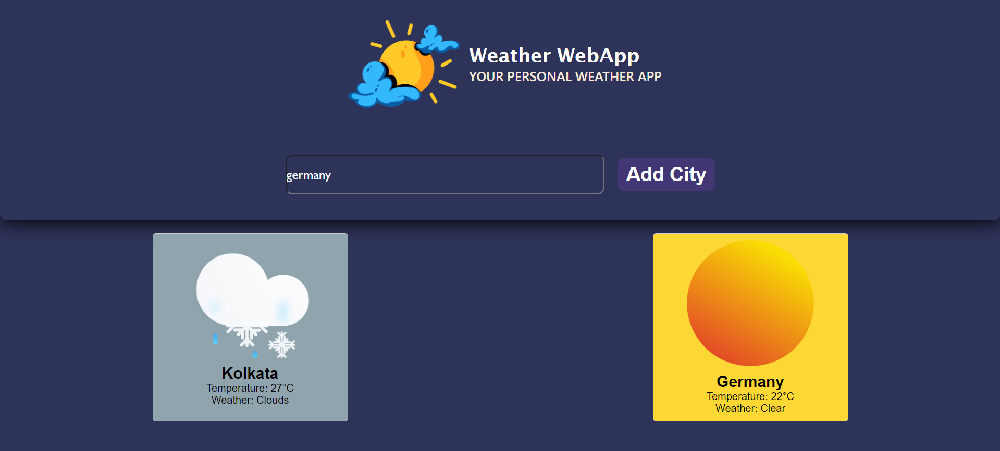

# Weather WebApp

Weather WebApp is a simple and elegant weather application that provides real-time weather information using the OpenWeatherMap API. It is built using HTML, CSS, and JavaScript.

## Features

- Current weather information
- Temperature, humidity, and wind speed
- Weather description and icon
- Location-based weather updates

## Demo

## Installation

1. Clone the repository:

    bash
    git clone https://github.com/tishasaha61/Weather-Website
    

2. Open the project directory:

    bash
    cd sky-observer
    

3. Open the index.html file in your web browser.

## Usage

1. Open index.html in your web browser.
2. Allow the application to access your location or enter a city name to get weather updates.
3. View the current weather information displayed on the screen.

## Configuration

1. Sign up for a free API key at [OpenWeatherMap](https://home.openweathermap.org/users/sign_up).
2. Replace YOUR_API_KEY in script.js with your OpenWeatherMap API key:

    javascript
    const apiKey = 'YOUR_API_KEY';
    

## Contributing

1. Fork the repository.
2. Create a new branch:

    bash
    git checkout -b feature/your-feature-name
    

3. Make your changes and commit them:

    bash
    git commit -m 'Add some feature'
    

4. Push to the branch:

    bash
    git push origin feature/your-feature-name
    

5. Open a pull request.

## Acknowledgements

- [OpenWeatherMap API](https://openweathermap.org/api)
- [Font Awesome](https://fontawesome.com/) for icons